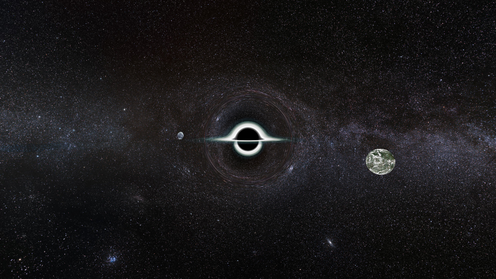

# RayTracer

Формат файла настроек:
ResH = 1080 - разрешение 
ResW = 1920
ViewAngH = 50 - углы обзора
ViewAngW = 120
Antialiasing = 0 - сглаживание
AlphaProc = 1 - использование альфа канала
Planets = 1 - отображение планет
ParallelOMP = 1 - распараллеливание с использованием OpenMP
Ratio = 10 - отношение радиусов черной дыры и диска
Mass = 8.57e36 - масса черной дыры
CameraPosX = 20e10 - позиция камеры
CameraPosY = 40e10
CameraPosZ = 40e+9
Planet1PosX = 0 - позиция первой планеты
Planet1PosY = 20e10
Planet1PosZ = 0
Planet2PosX = 0 - позиция второй планеты
Planet2PosY = -20e10
Planet2PosZ = 0